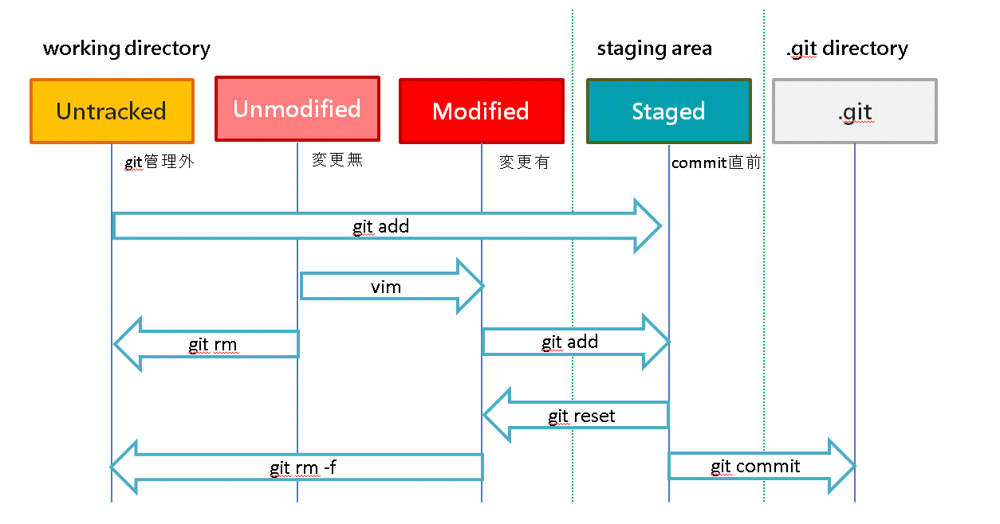

<!-- $size: 16:9 -->
<!-- page_number: true -->
<!-- $theme: default -->

はじめてのGit
===

###### 藤井 祥平 [@ompugao](https://twitter.com/ompugao)

---

# Gitのしくみ
###### だいじなことは２つ
- commit / commit graph
- ファイル(tree/blob)の３状態

---
# commit / commit graph
## commitとは

- revision(SHA-1 hash)
- author(コミットをつくった人）
- committer（コミットを適用した人）
- ファイル(tree)のsnapshot
- 一つ前のrevision(SHA-1 Hash)

---
# commit / commit graph
## commit graphとは

- commitでできたツリー構造
    - commitに含まれていた "一つ前のrevision" をつかって木構造をつくっている
---
# commit / commit graph
- commitにはrevision(hash)とディレクトリやファイルのスナップショットが入っている


quoted from: https://git-scm.com/book/ja/v2/Git-%E3%81%AE%E3%83%96%E3%83%A9%E3%83%B3%E3%83%81%E6%A9%9F%E8%83%BD-%E3%83%96%E3%83%A9%E3%83%B3%E3%83%81%E3%81%A8%E3%81%AF

---
# commit / commit graph
- 3commitくらいつくると、commitが数珠繋ぎになる


quoted from: https://git-scm.com/book/ja/v2/Git-%E3%81%AE%E3%83%96%E3%83%A9%E3%83%B3%E3%83%81%E6%A9%9F%E8%83%BD-%E3%83%96%E3%83%A9%E3%83%B3%E3%83%81%E3%81%A8%E3%81%AF

---
# commit / commit graph
- branchを切るとこうなる


quoted from: https://git-scm.com/book/ja/v2/Git-%E3%81%AE%E3%83%96%E3%83%A9%E3%83%B3%E3%83%81%E6%A9%9F%E8%83%BD-%E3%83%96%E3%83%A9%E3%83%B3%E3%83%81%E3%81%A8%E3%81%AF

---
# ファイルの３状態

- 作業ディレクトリ(Working Directory)
    - 作業するところ
↓ ```$ git add ```
- ステージング・エリア(Staging Area)
    - commitする準備段階
↓ ```$ git commit```
- Gitディレクトリ
	- commit graphがあるところ

<!--


こちらから引用: https://git-scm.com/book/ja/v2/%E4%BD%BF%E3%81%84%E5%A7%8B%E3%82%81%E3%82%8B-Git%E3%81%AE%E5%9F%BA%E6%9C%AC

-->
---
# ファイルの３状態
- ファイルを編集するときのライフサイクルはこんな感じ



- まぎらわしいので書いてませんが、stagedなfileをgit commitするとunmodifiedになります
<!--
- こちらから引用: https://git-scm.com/book/ja/v2/Git-%E3%81%AE%E5%9F%BA%E6%9C%AC-%E5%A4%89%E6%9B%B4%E5%86%85%E5%AE%B9%E3%81%AE%E3%83%AA%E3%83%9D%E3%82%B8%E3%83%88%E3%83%AA%E3%81%B8%E3%81%AE%E8%A8%98%E9%8C%B2
-->


---

# 以上を念頭に
- try gitをしてみましょう
- https://try.github.io/levels/1/challenges/1

---

# Appendix

「こわくない Git」というスライドを発表しました - kotas.tech
http://kotas.hatenablog.jp/entry/2012/11/22/000046


見えないチカラ: 【翻訳】Gitをボトムアップから理解する
http://keijinsonyaban.blogspot.jp/2011/05/git.html

